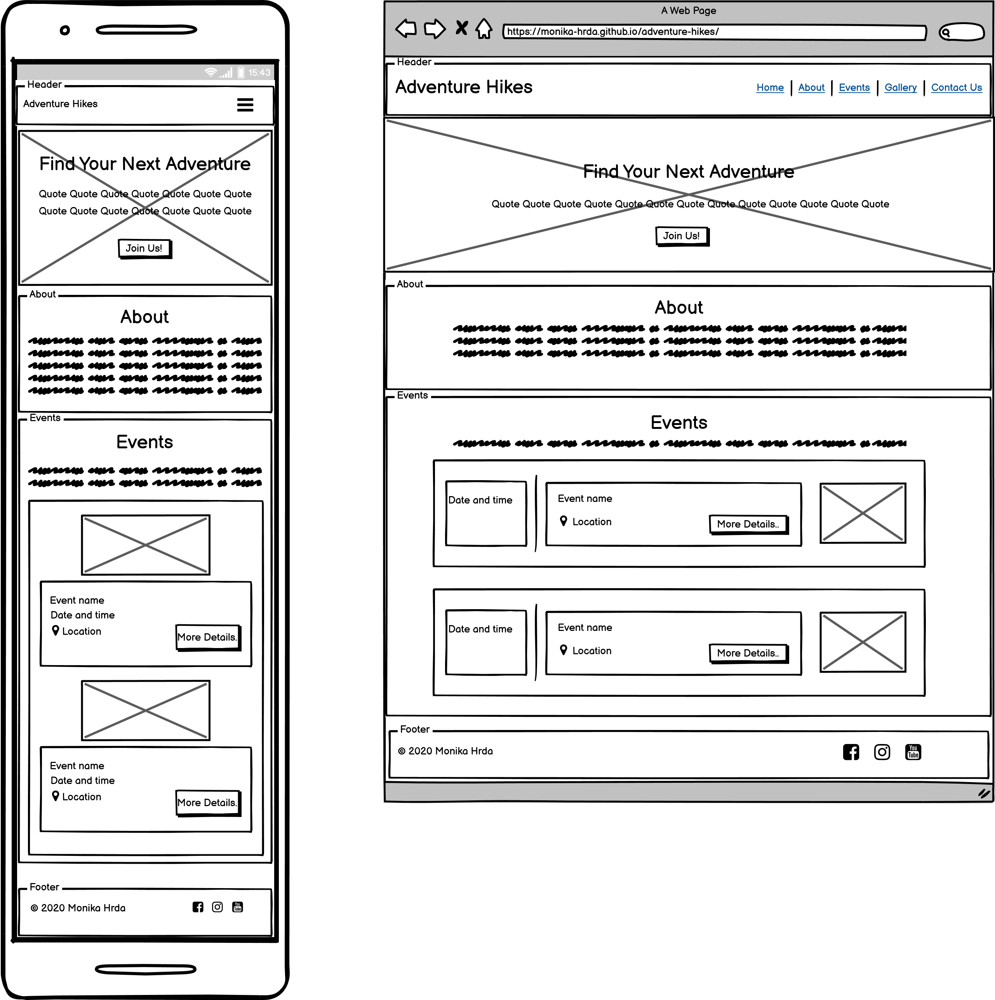
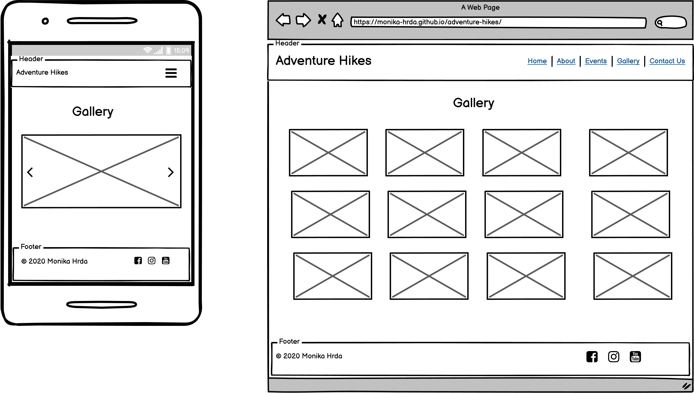
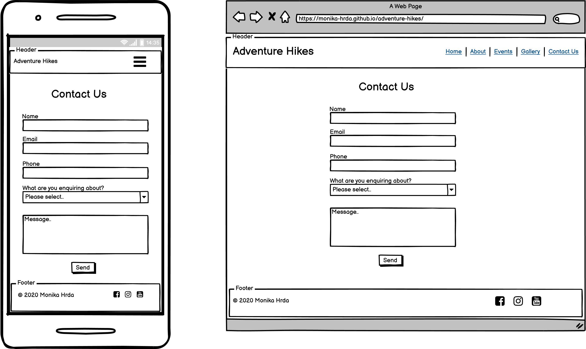

# Adventure Hikes
_“And into the forest I go, to lose my mind and find my soul.” - John Muir_

This is a website for a fictional hiking group Adventure Hikes. It primarily aims to inspire users to join the group on their outings. 

It was built as my first milestone project for Code Institute's Full Stack Software Development course, after I completed the HTML, CSS and User Centric Frontend Development modules. The topic for the project was chosen because hiking and adventure have always been close to my heart.

You can view the live website [here](https://monika-hrda.github.io/adventure-hikes/ "Adventure Hikes"). 
***
## User Experience (UX)

### User Stories

* As a new user, I want to easily understand what the purpose of the website is and what the group is about.
* As a new user, I want to be able to navigate the website easily, so that I can find any relevant content. 
* As a user, I want to be able to view the website clearly on my mobile device, so that I can achieve my other goals on the go.
* As a new user, I want to find some information about the group, its history and members, so that I can find out whether I would fit in.
* As a user, I want to be able to find out what new hikes or trips are organised, so that I can decide whether I want to join any of them.
* As a new user, I want to be able to find out how can I join any of the hikes or trips I am interested in.
* As a new user, I want to be able to see pictures from the group's past hikes and trips, so that I can get a feeling for the scenery on the hikes organised. 
* As a returning user, I want to be able to see pictures from the group's past hikes and trips, so that I can relive the ones I joined them on.
* As a user, I want to be able to find the group on social media, so that I can learn more and/or follow them / keep up with their updates.
* As a new user, I want to be able to contact the group, so that I can ask any specific questions and get more information.

### Design

* #### Colour Scheme

* #### Typography

  Open Sans font has been used as the main font, mostly for its high legibility and "friendly" appearance. In the unlikely case it is not imported into the website correctly, Sans Serif is the fallback font. 
  
  The second font used - for page headings and navbar - is Signika. It is easily readable, which makes it a great choice for use on smartphone screens as well.

* #### Imagery

  Images used on the website were selected with the intention of creating a friendly and welcoming effect (smiling people, a group of people hiking together), as well as showcase the nature of Ireland. The hero image is meant to draw the website visitor in, images in the events section depict the area each planned hike is taking place in, and images on the gallery page are meant to further interest the visitor in joining the group on one of their hikes.

  All of these photographs were taken by Monika Hrda, the website's author. They were optimized - resized and subsequently compressed on TinyJPG website - to not waste storage or bandwidth.

### Wireframes

After identifying high level content for the website (while working with all the user stories listed above), templates were first sketched out on paper. Wireframes were then created in Balsamiq, taking three different screen sizes into consideration - smartphone, tablet, and desktop. (As the desktop and tablet version almost do not differ (except the Gallery page which will see three images used per row in the tablet version, instead of the four used in the desktop version), I opted to leave the tablet one out from the following images in this case.)

Home page

Gallery page

Contact Us page

***
## Features

* Mobile-first design, with all pages fully responsive on all screen sizes.
* Fully responsive navbar, with menu collapsing on mobile devices and smaller screens.

### Existing Features

### Features Left to Implement

***
## Technologies Used

* HTML
* CSS
* Bootstrap
* Font Awesome
* Google Fonts
* jQuery
* Git
* Github
* Gitpod
* Github Pages
* Balsamiq
* [TinyJPG](https://tinyjpg.com/) - to optimize JPEG images

***
## Testing

***
## Deployment

***
## Credits

### Code

* tutorials from Code Institute's User Centric Frontend Development and CSS modules
* [Bootstrap navbar component](https://getbootstrap.com/docs/4.3/components/navbar/)

### Content

### Media

### Acknowledgements